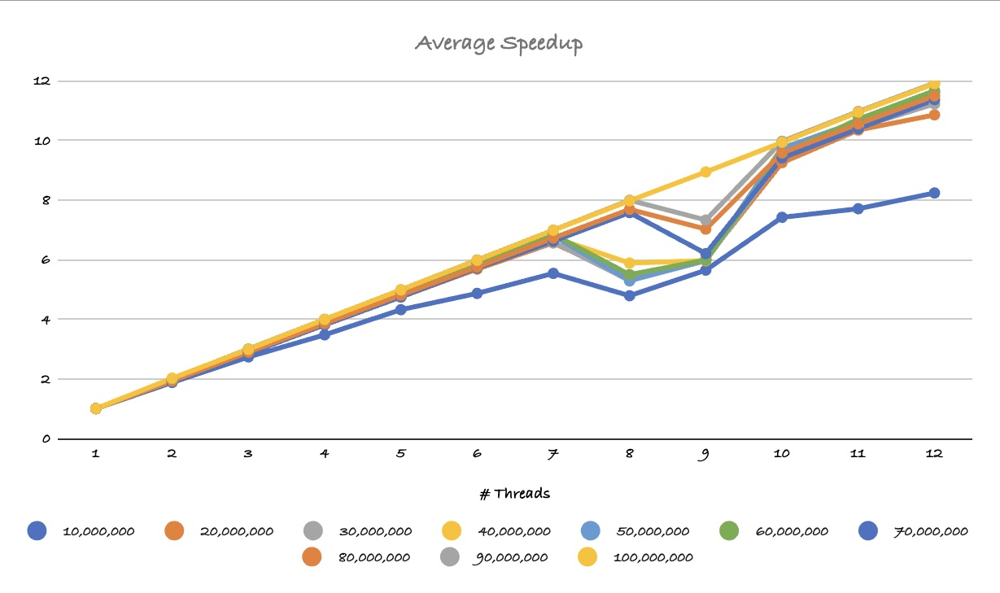
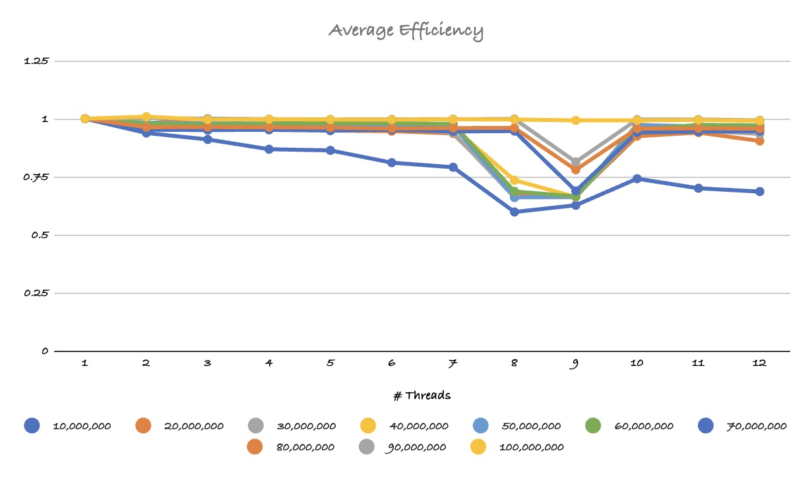
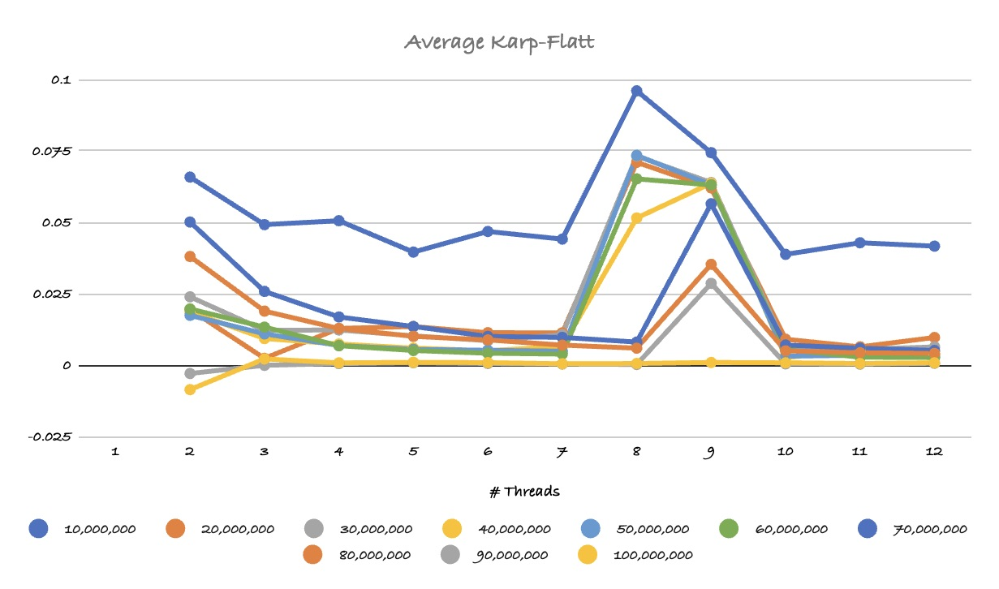

# Reflection 03: OpenMP II: Count Sort

Completed by Winston Shi

## Summary

This reflection uses code snippets from class to implement the parallelization of Count Sort. This code will be ran on the Ohio Supercomputing Center (OSC) servers.

This program will run a sorting function that sorts a vector of numbers in ascending order with a count sort function that is parallelized. Vectors are filled with a function that populate them with a random integer between 1 to 100. the size of the vectors range from 10,000 to 100,000 in steps of 10,000. these vectors are then sorted with 1 to 12 threads to see the speedup occuring with the increase in cores.

## Lessons Learned

**Key Lessons:**
 * Learned about Loop-Dependent variables that need to be privatized so that is does not effect other programs parallel to it.
 * Learned to setup a spreadsheet to organize data
 * Learned when setting parallel for without parameters sets to OMP_NUM_THREADS number of threads
 * Learned the default scheduling is equivalent to static scheduling with a system-chosen chunk size.
 * Learned that variables declared outside the parallel region are shared by default

**Code Snippets:**

**ACCOUNT NUMBER STAYS THE SAME**

```bash
#SBATCH --account=PCS0288
```

## Run Locally

Clone Repository

```bash
    git clone git@gitlab.com:Winston.Shi.BGSU/cs4170-fa2024-r03-shi.git reflection_03
```

Compile with Docker

```bash
    docker run --rm -v ${PWD}:/tmp -w /tmp/Default rgreen13/alpine-bash-gpp make all
```

Run with Docker

```bash
    docker run --rm -v ${PWD}:/tmp -w /tmp/Default rgreen13/alpine-bash-gpp ./OpenMP
```

## Run on Ohio Super Computer

Login to the Ohio Super Computer

```bash
ssh USERNAME@owens.osc.edu
```

Load the Git module and setup the environment to use a specific version of Git

```bash
module load git
```

Remove the value of the SSH_ASKPASS environment variable

```bash
unset SSH_ASKPASS
```

Clone repository

```bash
git clone git@gitlab.com:Winston.Shi.BGSU/cs4170-fa2024-r03-shi.git reflection_03
```

Change directory

```bash
cd reflection_03
```

Submit job using SLURM file

```bash
sbatch jobScript.slurm
```

Come back to repository after job completion confirmation

<div align="center">
    
<div align="left">

Change directory to Default File

```bash
cd Default
```

Open CVS file to see result

```bash
cat results.csv
```

## Check Job

job status

```bash
squeue -j BATCH_ID_NUM
```

OSC job queue

```bash
squeue
```

Show batch job information:
 * Resource usage statistics
 * CPU usage
 * Memory usage
 * I/O operations
 * Process creation rate

```bash
sacct -j BATCH_ID_NUM
```

## Results

**Execution Time**

| Threads | 10000 | 20000 | 30000 | 40000 | 50000 | 60000 | 70000 | 80000 | 90000 | 100000 |
|---------|-------|-------|-------|-------|-------|-------|-------|-------|-------|--------|
| 1 | 1.34239 | 5.25219 | 11.6416 | 20.8703 | 32.5621 | 46.9125 | 62.0026 | 81.8642 | 107.445 | 132.36 |
| 2 | 0.715382 | 2.67722 | 5.95994 | 10.6302 | 16.5646 | 23.9171 | 32.5539 | 42.4884 | 53.5638 | 65.6113 |
| 3 | 0.49148 | 1.75898 | 3.97507 | 7.08628 | 11.0914 | 16.0534 | 21.7341 | 28.3192 | 35.8091 | 44.3105 |
| 4 | 0.38649 | 1.36363 | 3.01772 | 5.33301 | 8.30802 | 11.9667 | 16.2839 | 21.2521 | 26.9036 | 33.1676 |
| 5 | 0.310972 | 1.10714 | 2.42365 | 4.27322 | 6.65574 | 9.57403 | 13.0712 | 17.0313 | 21.5596 | 26.5745 |
| 6 | 0.276057 | 0.925017 | 2.02319 | 3.56611 | 5.56777 | 7.98065 | 10.8517 | 14.2456 | 17.9587 | 22.1549 |
| 7 | 0.242524 | 0.801176 | 1.76923 | 3.09797 | 4.78777 | 6.85631 | 9.37309 | 12.1854 | 15.3814 | 18.9613 |
| 8 | 0.28061 | 0.982799 | 2.20066 | 3.54943 | 6.1628 | 8.54058 | 8.18745 | 10.6577 | 13.4509 | 16.6086 |
| 9 | 0.237903 | 0.873295 | 1.95513 | 3.50002 | 5.44413 | 7.84181 | 10.0024 | 11.6624 | 14.6707 | 14.8149 |
| 10 | 0.18108 | 0.567985 | 1.23201 | 2.13722 | 3.34748 | 4.92045 | 6.59127 | 8.55306 | 10.7863 | 13.3313 |
| 11 | 0.174309 | 0.507949 | 1.11655 | 1.99238 | 3.06189 | 4.38298 | 5.96932 | 7.76392 | 9.80064 | 12.0995 |
| 12 | 0.163111 | 0.484189 | 1.03802 | 1.80694 | 2.803 | 4.02334 | 5.45815 | 7.12897 | 9.01657 | 11.1274 |

**Speedup**



**Efficiency**



**Karp Flatt**



## Results Reflection

Thee results wihtin the Results Folder show the evaluations of the 120 Trials for the diferrent combinations of threads (1 to 12) and vector size (10,000 to 100,000). 

The speedup graph shows the average speed of parallel algorithm compared to serial program counterpart. The spedup is a linear line with a dip from 7 to 10 threads. The 100,000 line shows that as vector size n increases, the straighter the line is showing a consistent speedup throughout the number of threads.

Efficiency decreases with as the number of threads increase, though the decrease is very shallow compared to reflection 2. This shows that there is less of a return of investments as you add more cores to the program.

The Karp-Flatt Metric stays relatively flatt except from 7 to 10 cores, this indicated for these cores there an increase of overhead that could scale with the vector problem size. Looking back at these graphs I think it is safe to say this program scales with the problem size.

Was performance gained?

 * I do not believe so, but it has reached optimum results. According to claude.ai, the best lines for each graph is: 

```
Here's what these "good lines" might look like in practice:

Speedup: A line close to y = x (linear)
Efficiency: A horizontal line close to y = 1
Karp-Flatt: A horizontal line close to y = 0
```

Were there Loop-Dependencies when in the Count Sort Algorithm?

 * Yes, the count variable is dependent on the number searched for.

### Final Notes

Time Spent Writing reflection: 2 hours
 
Time spent coding: 1 hour

Time spent testing: 1 hour

Time spent analyzing: 1.5 hours

[TOC]